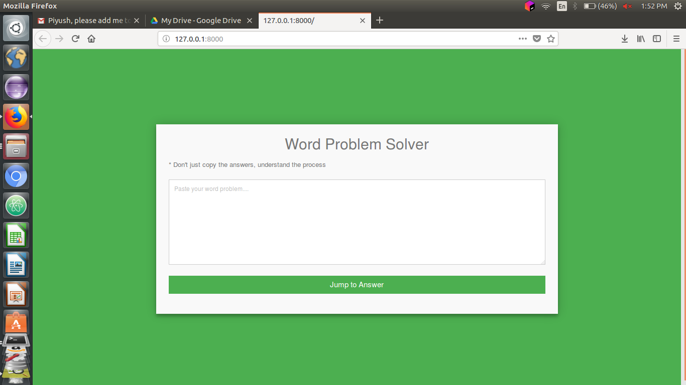
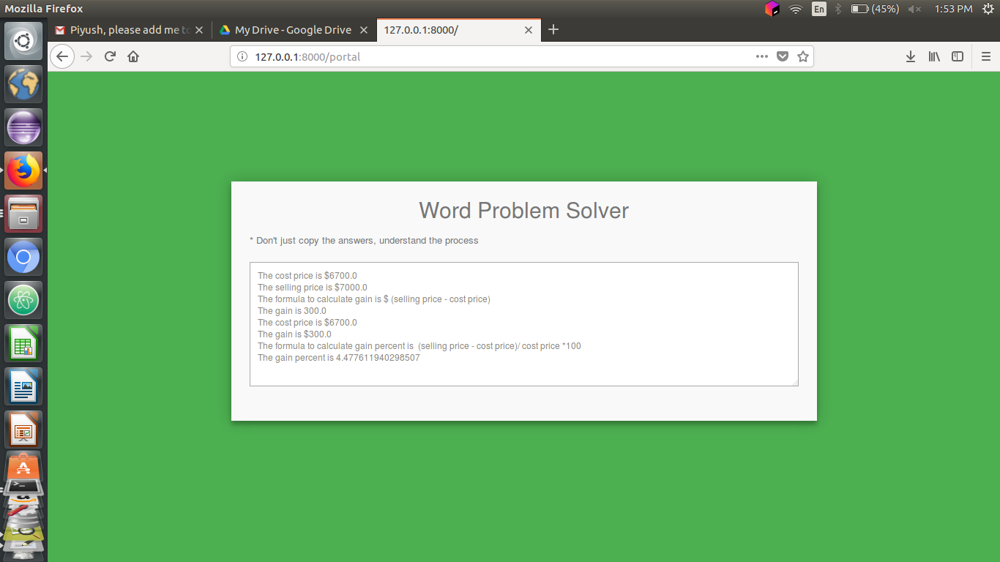

# WordProblemSolver

We have created a django app that is powered by nlp mechanism which accepts a word problem of profit and loss and solves it with the help of nlp libraries. It uses semantic approach to solve the word problem. This type of application is one of its kind. It is a research project at Stanford. Most of the famous websites like byju's , math solver, math4world etc solves the se type of problem by accepting the values manually and then solving the problem with predefined formula but this app can solve profit loss word problems with semantic approach. Without any added human input. 

